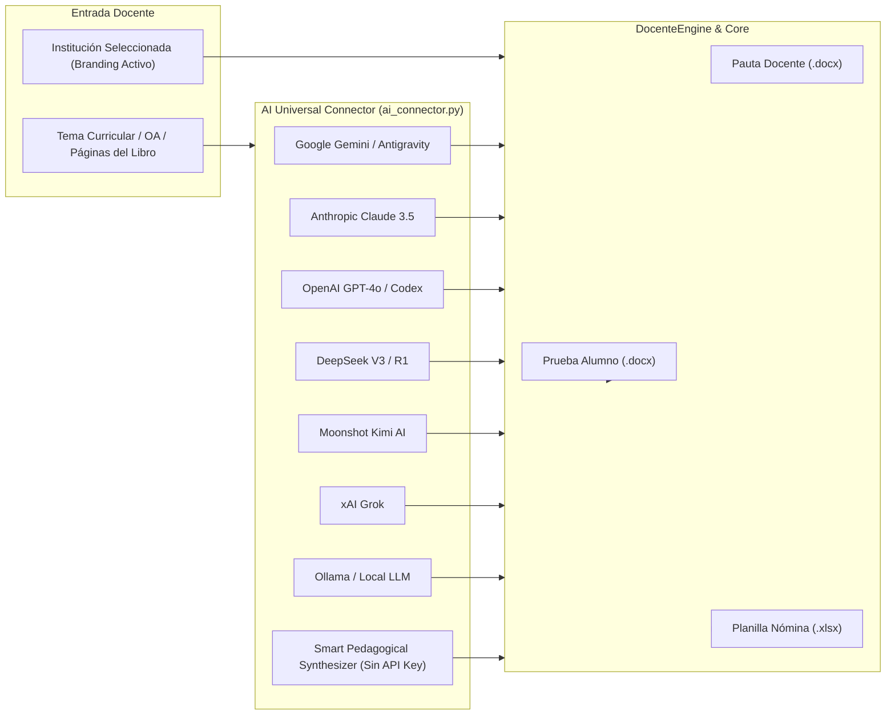

<div align="center">

[🇺🇸 **Read in English (Main README)**](README.md) · **[🇪🇸 Leer en Español (Actual)](README.es.md)**


# 🎓 EduDocente-Studio
### *Motor Pedagógico Declarativo, Inteligencia Artificial Multi-Proveedor y Memoria Institucional*

[](https://python.org)
[](#-conector-universal-multi-ia)
[](#-memoria-de-identidad-multi-colegio--branding)
[](#-autenticación-y-single-sign-on-oauth-20)
[](LICENSE)

<p align="center">
  <b>Generador declarativo y asistido por IA de evaluaciones escolares, pautas de corrección con justificación pedagógica, temarios oficiales para apoderados, planillas dinámicas de nóminas en Excel (.xlsx) y memoria de identidad para docentes multicolegio.</b>
</p>

[✨ Características](#-características-principales) •
[🤖 Conector Multi-IA](#-conector-universal-multi-ia) •
[🏛️ Memoria Multi-Colegio](#-memoria-de-identidad-multi-colegio--branding) •
[📊 Nóminas Excel](#-gestor-especializado-de-nóminas-y-entrevistas-excel) •
[🔐 OAuth 2.0](#-autenticación-y-single-sign-on-oauth-20) •
[🏭 Despliegue Industrial](#-despliegue-en-entornos-de-producción-e-industria) •
[💻 Modos de Uso](#-modos-de-uso) •
[📄 Licencia](#-licencia)

</div>

---

## 💡 El Problema y la Solución

### El Desafío
Los docentes dedican decenas de horas semanales a diseñar pruebas, redactar solucionarios con retroalimentación explicada, elaborar temarios informativos para apoderados y cuadrar planillas de entrevistas. En procesadores de texto manuales, esto conlleva:
* **Desalineaciones de diseño e imagen:** Muchos profesores imparten clases en 2 o más colegios distintos y deben rehacer manualmente encabezados, logos y colores.
* **Filtración involuntaria:** Pistas o respuestas dejadas por descuido en la copia del estudiante.
* **Falta de fundamentación pedagógica:** Solucionarios escuetos sin citas directas a las páginas del texto de estudio.
* **Desorden en planillas:** Nóminas de apoderados desactualizadas y sin formato condicional estándar.

### Nuestra Solución
**EduDocente-Studio** estandariza este flujo de trabajo mediante:
1. **Memoria Multi-Colegio:** Guarda perfiles de instituciones (logos en alta resolución sin fondo, colores corporativos primarios y secundarios, lemas y departamentos) que se aplican automáticamente a cualquier documento generado.
2. **Arquitectura Pedagógica de 3 Ítems:**
   - **Ítem I (Selección Múltiple):** Alternativas directas `A)`, `B)`, `C)`, `D)` sin casillas distractoras, con clave y justificación formal en la pauta.
   - **Ítem II (Verdadero o Falso):** Casillas limpias `(   )` para el alumno y tabla de justificaciones pedagógicas con respuestas destacadas en verde institucional (`#1E7E34`) para el profesor.
   - **Ítem III (Aplicación Práctica / Dibujo / Esquema Técnico):** Marcos delimitados para dibujar con líneas de explicación, o láminas vectoriales tipo esqueleto para rotular y pintar.
3. **Gestor de Nóminas Excel Dinámicas:** Planillas openpyxl configurables para citación de apoderados con validación desplegable de asistencia y formato institucional automático.

---

## 🤖 Conector Universal Multi-IA (Pedagogical AI Agent)

EduDocente-Studio integra un **agente de inteligencia artificial agnóstico a proveedores** (`ai_connector.py`). Al indicar únicamente los contenidos o el Objetivo de Aprendizaje (OA), el sistema:

1. **Investiga y sintetiza:** Explora los conceptos clave del currículo escolar y las referencias del texto escolar.
2. **Compara y valida:** Contrasta con las directrices pedagógicas oficiales para evitar preguntas ambiguas o sesgadas.
3. **Estructura y envía:** Emite el esquema JSON estandarizado directamente al motor de renderizado Word institucional.



### Proveedores Soportados:
* ♊ **Google Gemini / Antigravity** (`gemini-1.5-pro` / `gemini-2.0-flash`)
* 🧠 **Anthropic Claude** (`claude-3-5-sonnet`)
* ⚡ **OpenAI / Codex** (`gpt-4o`)
* 🐋 **DeepSeek** (`deepseek-chat` / `deepseek-reasoner` V3 / R1)
* 🌙 **Moonshot Kimi AI** (`moonshot-v1-8k`)
* 🚀 **xAI Grok** (`grok-beta`)
* 💻 **Local / Ollama** (`llama3.2`, etc.)
* 🛡️ **Smart Pedagogical Synthesizer:** Fallback heurístico local **Zero-Crash** que funciona sin claves de API para pruebas inmediatas.

---

## 🏛️ Memoria de Identidad Multi-Colegio & Branding

Si un profesor trabaja en varias escuelas o liceos, puede almacenar sus perfiles en `config/institutions.json`:

```json
{
  "id": "liceo_bicentenario",
  "name": "LICEO BICENTENARIO DE EXCELENCIA",
  "sub_header": "UNIDAD TÉCNICO PEDAGÓGICA (UTP)",
  "motto": "Compromiso, Mérito y Superación",
  "logo_path": "assets/logos/logo_bicentenario.png",
  "font_family": "Arial",
  "colors": {
    "primary_hex": "0D5C3A",
    "secondary_hex": "E8F5E9",
    "card_bg_hex": "F1F8E9",
    "border_hex": "A5D6A7",
    "teacher_correct_hex": "1E7E34"
  },
  "is_active": true
}
```

* **Cambio Dinámico:** Al alternar el colegio activo en la barra superior de la Interfaz Web o mediante `institution_manager.set_active("id")`, todas las pruebas, pautas y planillas Excel adoptan de inmediato el logo de alta resolución, membrete y paleta cromática de dicho colegio.
* **Soporte de Logos:** Permite logos transparentes en formatos PNG, SVG o WEBP de hasta 4K de resolución.

---

## 📊 Gestor Especializado de Nóminas y Entrevistas Excel

El módulo `roster_manager.py` automatiza la citación mensual de apoderados y gestión de cursos:

* **Columnas Configurables:** `N°`, `Nombre del apoderado/a`, `Correo electrónico`, `Nombre del/la estudiante`, `Curso`, `Día`, `Fecha entrevista`, `Hora de entrevista`, `Estado` y `Observaciones`.
* **Validación de Datos en Celda:** Menú desplegable nativo en Excel para estados: `Confirmado`, `Pendiente`, `Reprogramado`, `Inasistencia`.
* **Estilo Institucional:** Cabecera con el color corporativo del colegio, bordes suaves, alternancia zebra (`#F6FAFE` / `#FFFFFF`) y anchos de columna auto-ajustados.
* **Actualizable en Vivo:** Agrega nuevas entrevistas desde la pestaña **"2. Nóminas & Entrevistas Excel"** de la Web UI o vía API REST (`POST /api/roster/add`).

---

## 🔐 Autenticación y Single Sign-On (OAuth 2.0)

El módulo `oauth_manager.py` permite vincular credenciales institucionales:

1. **Google Workspace for Education / Google Classroom:**
   - Permisos de lectura de cursos y nóminas de alumnos (`classroom.courses.readonly`, `classroom.rosters.readonly`).
2. **GitHub Academic (`@JackStar6677-1`):**
   - Sincronización con repositorios de aula y código didáctico.
3. **Microsoft 365 Educación (Entra ID):**
   - Integración con cuentas escolares de Microsoft Teams y Outlook institucional.
4. **Modo Sandbox Educativo:**
   - Permite probar el flujo de autenticación de forma inmediata en entornos locales sin requerir aprobación previa en Google Cloud Console.

---

## 🏭 Despliegue en Entornos de Producción e Industria

### Opción 1: Instalación Rápida con 1 Clic (Recomendada para Profesores)
* **En Windows:** Haz doble clic en `install.bat` para instalar las dependencias y luego en `start.bat` para iniciar la interfaz gráfica.
* **En Linux / macOS:**
  ```bash
  chmod +x install.sh
  ./install.sh
  python3 app.py
  ```

### Opción 2: Despliegue con Contenedores Docker (Para Departamentos de TI Escolar)
```bash
# Construir y levantar el contenedor en segundo plano
docker-compose up -d

# Acceder a la plataforma en:
# http://localhost:8080
```

### Opción 3: Variables de Entorno de Producción (`.env`)
Copia la plantilla `.env.example` a `.env` y configura tus credenciales:
```env
GOOGLE_CLIENT_ID=tu_cliente_google.apps.googleusercontent.com
GOOGLE_CLIENT_SECRET=tu_secreto_google
GEMINI_API_KEY=tu_clave_gemini
PORT=8080
```

---

## 💻 Modos de Uso

### 1. Interfaz Web Gráfica (Web UI)
Inicia el servidor local y abre la aplicación en tu navegador predeterminado:
```bash
python app.py
# o también:
python main.py --web
```

### 2. Generación Asistida por IA por Consola
```bash
python ai_connector.py
# o también:
python main.py --ai
```

### 3. Asistente Manual Paso a Paso (Wizard CLI)
```bash
python wizard.py
# o también:
python main.py --wizard
```

### 4. Orquestador en Lote del Colegio
```bash
python main.py --all            # Genera todo el material institucional
python main.py --excel          # Regenera el cronograma de entrevistas en Excel
```

---

## 📁 Estructura del Proyecto

```text
evaluaciones_pasteur/
│
├── assets/                               # Recursos gráficos y logos
│   ├── banner_animated.svg               # Banner interactivo para GitHub
│   ├── logo_colegio.png                  # Escudo oficial de alta resolución
│   ├── circuit_components/               # Símbolos esquemáticos vectoriales
│   ├── matter_states/                    # Modelos corpusculares
│   └── atom_model/                       # Modelo atómico de Dalton
│
├── config/                               # Memoria persistente del sistema
│   ├── institutions.json                 # Perfiles, logos y colores de colegios
│   └── roster_data.json                  # Nómina configurable de apoderados y citas
│
├── web/                                  # Interfaz gráfica de usuario (SPA)
│   └── index.html                        # Panel interactivo moderno (Tailwind CSS)
│
├── output/                               # Entregables oficiales compilados
│   ├── temarios/                         # Temarios oficiales para apoderados
│   ├── Evaluacion_Final_Ciencias_6Basico.docx
│   ├── Pauta_Correccion_Ciencias_6Basico.docx
│   └── Cronograma_Entrevistas_Apoderados_2026.xlsx
│
├── app.py                                # Servidor Web local y API REST multi-hilo
├── oauth_manager.py                      # Gestor de autenticación OAuth 2.0 (Google/GitHub/M365)
├── institution_manager.py                # Memoria de Identidad Multi-Colegio y Branding
├── roster_manager.py                     # Gestor de Nóminas y Cronogramas en Excel
├── ai_connector.py                       # Conector Universal Multi-IA (Claude, Gemini, GPT, DeepSeek)
├── engine.py                             # Motor declarativo central (DocenteEngine)
├── generator_core.py                     # Motor base de renderizado XML y estilos dinámicos
├── wizard.py                             # Asistente CLI interactivo
├── main.py                               # Orquestador del sistema con flags y menú
│
├── install.bat / install.sh              # Instaladores de 1 clic para Windows y Linux/Mac
├── start.bat                             # Lanzador directo de la interfaz web
├── Dockerfile / docker-compose.yml       # Contenedores para despliegue industrial
├── .env.example                          # Plantilla de credenciales OAuth e IA
├── requirements.txt                      # Dependencias de Python
├── LICENSE                               # Licencia MIT
└── README.md                             # Documentación del proyecto (Inglés principal)
```

---

## 👨‍💻 Autor y Reconocimientos

- **Desarrollo y Arquitectura de Software:** Jack ([@Jackstar6677-1](https://github.com/Jackstar6677-1))
- **Asesoría y Validación Pedagógica:** Profesora Margarita Miranda B. (*C.E.P. Luis Pasteur Anexo*)
- **Contacto:** `profesora.margaritamiranda@cepluispasteur.cl`

---

## 📄 Licencia

Este proyecto está liberado bajo la [Licencia MIT](LICENSE). Siéntete libre de utilizarlo, bifurcarlo y adaptarlo para tu propia institución educativa.
