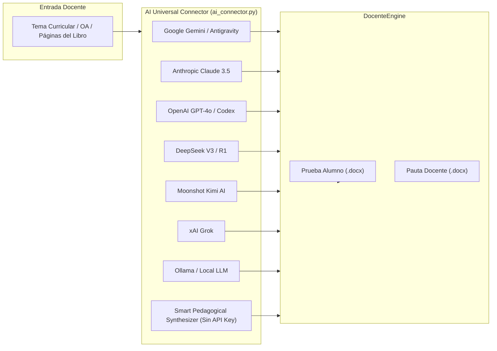
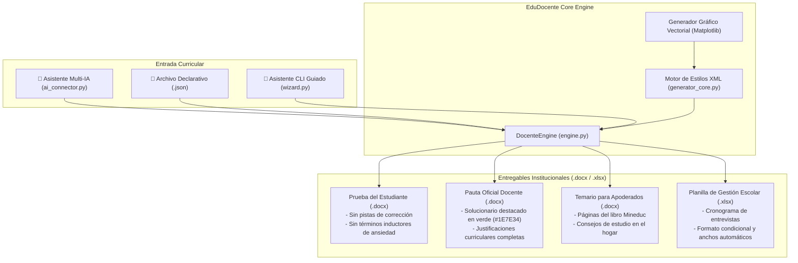

<div align="center">


# 🎓 EduDocente-Studio
### *Automated Pedagogical Assessment & Multi-AI Curriculum Engine*

[](https://python.org)
[](#-conector-universal-multi-ia)
[](https://python-docx.readthedocs.io/)
[](https://openpyxl.readthedocs.io/)
[](LICENSE)

<p align="center">
  <b>Generador declarativo y asistido por IA de evaluaciones escolares, pautas de corrección con justificación pedagógica, temarios oficiales para apoderados y planillas de gestión docente en Word (.docx) y Excel (.xlsx).</b>
</p>

[✨ Características](#-características-principales) •
[🤖 Conector Multi-IA](#-conector-universal-multi-ia) •
[🏛️ Arquitectura](#-arquitectura-del-sistema) •
[🚀 Instalación](#-instalación-y-puesta-en-marcha) •
[💻 Modos de Uso](#-modos-de-uso) •
[🏆 Materiales de Aula](#-materiales-docentes-listos-para-producción) •
[📄 Licencia](#-licencia)

</div>

---

## 💡 El Problema y la Solución

### El Desafío
Los docentes dedican decenas de horas semanales a diseñar pruebas, redactar solucionarios con retroalimentación explicada, elaborar temarios informativos para apoderados y cuadrar planillas de entrevistas. En procesadores de texto manuales, esto conlleva:
* Desalineaciones tipográficas y estéticas entre instrumentos.
* Filtración involuntaria de pistas o respuestas en los enunciados.
* Falta de justificaciones pedagógicas claras para la retroalimentación al estudiante.
* Duplicación innecesaria de trabajo entre la versión del alumno, la pauta docente y el temario a las familias.

### Nuestra Solución
**EduDocente-Studio** estandariza este flujo de trabajo mediante un motor de software con **arquitectura pedagógica de 3 ítems universales**:
1. **Ítem I (Selección Múltiple):** Alternativas directas `A)`, `B)`, `C)`, `D)` sin casillas distractoras, con clave y justificación formal en la pauta.
2. **Ítem II (Verdadero o Falso):** Casillas limpias `(   )` para el alumno y tabla de justificaciones pedagógicas con respuestas destacadas en verde institucional (`#1E7E34`) para el profesor.
3. **Ítem III (Aplicación Práctica / Dibujo / Esquema Técnico):** Marcos delimitados para dibujar con líneas de explicación, o láminas vectoriales tipo esqueleto para rotular y pintar.

---

## 🤖 Conector Universal Multi-IA (Pedagogical AI Agent)

EduDocente-Studio integra un **agente de inteligencia artificial agnóstico a proveedores** (`ai_connector.py`). Al indicar únicamente los contenidos o el Objetivo de Aprendizaje (OA), el sistema:

1. **Investiga y sintetiza:** Explora los conceptos clave del currículo escolar y las referencias del texto Mineduc.
2. **Compara y valida:** Contrasta con las directrices pedagógicas oficiales para evitar preguntas ambiguas o sesgadas.
3. **Estructura y envía:** Emite el esquema JSON estandarizado directamente al motor de renderizado Word institucional.



### Proveedores Soportados y Variables de Entorno:

| Proveedor | Modelo Predeterminado | Variable de Entorno | Notas |
| :--- | :--- | :--- | :--- |
| **Google Gemini / Antigravity** | `gemini-1.5-pro` / `gemini-2.0-flash` | `GEMINI_API_KEY` | Soporte nativo para grounding y búsqueda web |
| **Anthropic Claude** | `claude-3-5-sonnet-20241022` | `ANTHROPIC_API_KEY` | Máxima precisión en justificaciones pedagógicas |
| **OpenAI / Codex** | `gpt-4o` | `OPENAI_API_KEY` | Respuestas JSON estructuradas de alta velocidad |
| **DeepSeek** | `deepseek-chat` / `deepseek-reasoner` | `DEEPSEEK_API_KEY` | Razonamiento deductivo avanzado para ciencias |
| **Kimi (Moonshot)** | `moonshot-v1-8k` | `MOONSHOT_API_KEY` | Procesamiento profundo de textos escolares extensos |
| **Grok (xAI)** | `grok-beta` | `XAI_API_KEY` | Síntesis concisa y directa |
| **Local / Ollama** | `llama3.2` / `deepseek-r1` | *Sin clave requerida* | Privacidad 100% offline en tu equipo |
| **Smart Synthesizer** | *Motor heurístico local* | *Automático* | **Zero-Crash**: Funciona sin internet ni claves de API |

> [!TIP]
> Si no cuentas con una clave de API configurada, el conector activa automáticamente su **Smart Pedagogical Synthesizer** local, permitiéndote probar todo el pipeline de compilación sin costo alguno.

---

## 🏛️ Arquitectura del Sistema



---

## ✨ Características Principales

* 🎨 **Línea Gráfica Institucional Impecable:**
  - Tipografía unificada `Arial` en todo el documento.
  - Paleta de color armónica: Azul Marino Institucional (`#173F73`), Azul Cielo Suave (`#EAF3FB`), Fondo de Tarjetas (`#F6FAFE`) y Borde Acero (`#B0C4DE`).
  - Escudo institucional insertado con proporciones matemáticas perfectas.
* ⚖️ **Rigor Pedagógico Integrado:**
  - Eliminación estricta de términos contraproducentes (prohibida la palabra `SUMATIVA`, prohibidos porcentajes de exigencia como `60%`, prohibidas escalas de conversión `1.0 a 7.0` en la prueba del alumno, prohibidos tiempos límites estimados).
  - Respuestas docentes 100% fundamentadas para retroalimentación formativa inmediata.
* 📐 **Generación Vectorial de Recursos Didácticos:**
  - **Circuitos Eléctricos:** Símbolos esquemáticos normalizados (fuente de poder, interruptor abierto/cerrado, ampolleta con cruz circular, cables ortogonales).
  - **Modelo Corpuscular:** Distribución estocástica de partículas según estados sólido, líquido y gaseoso.
  - **Estructura Atómica:** Modelo de Bohr/Dalton con órbitas elípticas, corteza, núcleo, protones, neutrones y electrones.
* 📦 **Despliegue Multi-Directorio:** Salida sincronizada localmente en el repositorio Git y en las carpetas de gestión docente de Descargas.

---

## 📁 Estructura del Proyecto

```text
evaluaciones_pasteur/
│
├── assets/                               # Recursos gráficos vectoriales e insignias
│   ├── banner_animated.svg               # Banner interactivo animado para GitHub
│   ├── logo_colegio.png                  # Escudo oficial de la institución
│   ├── circuit_components/               # Símbolos esquemáticos de circuitos eléctricos
│   ├── matter_states/                    # Modelos corpusculares de la materia
│   └── atom_model/                       # Esqueleto y modelo atómico resuelto
│
├── output/                               # Entregables compilados (.docx y .xlsx)
│   ├── temarios/                         # Temarios oficiales para enviar por correo
│   ├── Evaluacion_Final_Ciencias_5Basico.docx
│   ├── Pauta_Correccion_Ciencias_5Basico.docx
│   ├── Evaluacion_Final_Ciencias_6Basico.docx
│   ├── Pauta_Correccion_Ciencias_6Basico.docx
│   ├── Evaluacion_Final_Ciencias_8Basico.docx
│   ├── Pauta_Correccion_Ciencias_8Basico.docx
│   ├── Rubrica_Evaluacion_Final_Musica_1Basico.docx
│   ├── Rubrica_Evaluacion_Final_Musica_2Basico.docx
│   ├── Evaluacion_Final_Orientacion_5Basico.docx
│   ├── Pauta_Correccion_Orientacion_5Basico.docx
│   └── Cronograma_Entrevistas_Apoderados_2026.xlsx
│
├── ai_connector.py                       # Conector Universal Multi-IA (Claude, Gemini, GPT, DeepSeek)
├── engine.py                             # Motor declarativo central (DocenteEngine)
├── wizard.py                             # Asistente CLI interactivo para crear nuevas pruebas
├── generator_core.py                     # Motor base de renderizado XML y estilos python-docx
├── main.py                               # Orquestador del sistema con menú interactivo y flags
│
├── build_temarios.py                     # Compilador unificado de los 6 temarios a apoderados
├── build_student_test.py                 # Generador Evaluación 5° Básico (OA 11 - 28 pts)
├── build_teacher_answer_key.py           # Generador Pauta 5° Básico
├── build_student_test_6basico.py         # Generador Evaluación 6° Básico (OA 13 - 26 pts)
├── build_teacher_answer_key_6basico.py   # Generador Pauta 6° Básico
├── build_ciencias_8basico.py             # Generador Evaluación y Pauta 8° Básico (OA 3 - 25 pts)
├── build_rubricas_musica.py              # Generador Rúbricas Música 1°A y 2°A (25 pts c/u)
├── build_orientacion_5basico.py          # Generador Evaluación y Pauta Orientación 5°A (OA 5 - 25 pts)
├── crear_excel_entrevistas.py            # Generador de Planilla Excel de Entrevistas
│
├── generate_atom_assets.py               # Renderizador gráfico del átomo (Matplotlib)
├── generate_matter_states.py             # Renderizador de estados de la materia
├── perfect_symbols.py                    # Renderizador de circuitos normalizados
│
├── examples/                             # Plantillas JSON de evaluaciones declarativas
│   └── evaluacion_modelo.json            # Plantilla base para nuevas evaluaciones
├── requirements.txt                      # Dependencias de Python
├── LICENSE                               # Licencia MIT
└── README.md                             # Documentación del proyecto
```

---

## 🚀 Instalación y Puesta en Marcha

### 1. Clonar el repositorio
```bash
git clone https://github.com/tu-usuario/edudocente-studio.git
cd edudocente-studio
```

### 2. Instalar dependencias
```bash
pip install -r requirements.txt
```

### 3. Configurar claves de API (Opcional)
```bash
# En Windows PowerShell:
$env:GEMINI_API_KEY="tu_clave_gemini"
$env:ANTHROPIC_API_KEY="tu_clave_claude"
$env:OPENAI_API_KEY="tu_clave_openai"
$env:DEEPSEEK_API_KEY="tu_clave_deepseek"

# En Linux / macOS / Bash:
export GEMINI_API_KEY="tu_clave_gemini"
export ANTHROPIC_API_KEY="tu_clave_claude"
export OPENAI_API_KEY="tu_clave_openai"
export DEEPSEEK_API_KEY="tu_clave_deepseek"
```

---

## 💻 Modos de Uso

### Opción 1: Generación Asistida por Inteligencia Artificial (IA)
Solo indica el tema y el curso; la IA consultará las fuentes, comparará con las pautas curriculares y generará el paquete evaluativo:
```bash
python ai_connector.py
# o también:
python main.py --ai
```

### Opción 2: Asistente Interactivo de Creación Manual (Wizard)
Construye una evaluación paso a paso respondiendo preguntas en la consola:
```bash
python wizard.py
# o también:
python main.py --wizard
```

### Opción 3: Compilación Declarativa desde JSON
Crea o edita un archivo `.json` y compílalo programáticamente:
```python
from engine import DocenteEngine

engine = DocenteEngine("examples/evaluacion_modelo.json")
prueba_docx, pauta_docx = engine.build_all()
print(f"Evaluación creada en: {prueba_docx}")
```

### Opción 4: Orquestador General del Colegio
Genera el paquete completo del colegio o módulos específicos:
```bash
python main.py                  # Abre el menú interactivo con 11 opciones

# Banderas directas por consola:
python main.py --all            # Genera todo el material docente (Word, Excel y gráficos)
python main.py --ciencias8      # Genera evaluación y pauta de Ciencias 8° Básico
python main.py --musica         # Genera rúbricas prácticas de Música 1° y 2° Básico
python main.py --orientacion    # Genera prueba y pauta de Orientación 5° Básico
python main.py --temarios       # Genera los 6 temarios para enviar a apoderados
python main.py --excel          # Genera la planilla Excel de entrevistas
```

---

## 📋 Estructura de Configuración Declarativa (JSON)

```json
{
  "colegio": "COLEGIO LUIS PASTEUR ANEXO",
  "asignatura": "CIENCIAS NATURALES",
  "curso": "7° Básico A",
  "titulo": "EVALUACIÓN FINAL: MICROORGANISMOS Y BACTERIAS",
  "oa": "OA 7 — Investigar y explicar las características de virus y bacterias.",
  "contenidos": "Microorganismos patógenos y benéficos, estructura y prevención.",
  "puntaje_total": 25,
  
  "item1_seleccion_multiple": [
    {
      "pregunta": "1. ¿Qué estructura celular es propia de las bacterias?",
      "alternativas": [
        ["A", "Pared celular y material genético libre en el citoplasma."],
        ["B", "Núcleo delimitado por membrana carioteca."],
        ["C", "Cápsula de cristal inorgánico."],
        ["D", "Ausencia total de ribosomas."]
      ],
      "correcta": "A) Pared celular y material genético libre en el citoplasma.",
      "justificacion": "Las bacterias son organismos procariontes sin núcleo delimitado por carioteca."
    }
  ],

  "item2_verdadero_falso": [
    {
      "oracion": "Los virus son considerados células vivas con metabolismo independiente.",
      "resp": "F",
      "justificacion": "Los virus son agentes acelulares que requieren una célula hospedera para replicarse."
    }
  ],

  "item3_aplicacion": {
    "titulo": "ÍTEM III: DIBUJO Y EXPLICACIÓN DE MEDIDAS PREVENTIVAS",
    "puntaje": 5,
    "tipo": "drawing_boxes",
    "instruccion": "Dibuja en el recuadro una medida de prevención sanitaria y descríbela:",
    "cajas": [
      {
        "titulo": "Medida: Lavado adecuado de manos con jabón",
        "ejemplo_pauta": "Estudiante lavando manos con agua y jabón disolviendo la cubierta viral."
      }
    ]
  }
}
```

---

## 🏆 Materiales Docentes Listos para Producción

El repositorio incluye casos reales listos para aula generados para el **Colegio Luis Pasteur Anexo**:

| Asignatura | Curso | Instrumento Evaluativo | Puntaje | Entregables |
| :--- | :--- | :--- | :---: | :--- |
| **Ciencias Naturales** | 5° Básico A-B | Energía eléctrica y circuitos | 28 pts | Prueba, Pauta y Temario |
| **Ciencias Naturales** | 6° Básico A-B | Cambios de estado y partículas | 26 pts | Prueba, Pauta y Temario |
| **Ciencias Naturales** | 8° Básico A | Teoría atómica de Dalton y átomo | 25 pts | Prueba, Pauta con modelo resuelto y Temario |
| **Música** | 1° Básico A | Canto al unísono y percusión (*Estrellita*) | 25 pts | Rúbrica práctica de aula y Temario |
| **Música** | 2° Básico A | Interpretación coral y metalófono | 25 pts | Rúbrica práctica de aula y Temario |
| **Orientación** | 5° Básico A | Prevención de drogas y autocuidado | 25 pts | Prueba, Pauta con justificaciones y Temario |
| **Gestión Docente** | Jefatura / Asignatura | Cronograma de entrevistas a apoderados | — | Planilla Excel automatizada (16 apoderados) |

---

## 👨‍💻 Autor y Reconocimientos

- **Desarrollo y Arquitectura de Software:** Jack ([GitHub Profile](https://github.com))
- **Asesoría y Validación Pedagógica:** Profesora Margarita Miranda B. (*C.E.P. Luis Pasteur Anexo*)
- **Contacto:** `profesora.margaritamiranda@cepluispasteur.cl`

---

## 📄 Licencia

Este proyecto está liberado bajo la [Licencia MIT](LICENSE). Siéntete libre de utilizarlo, bifurcarlo y adaptarlo para tu propia institución educativa.
