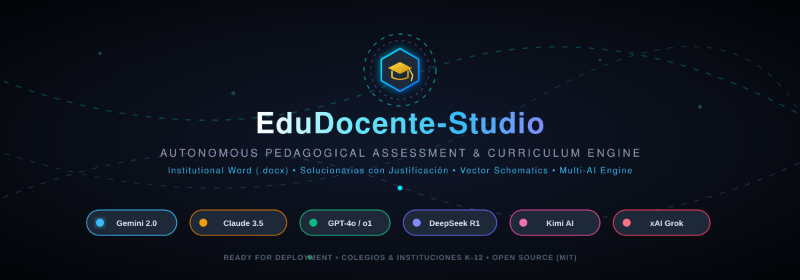
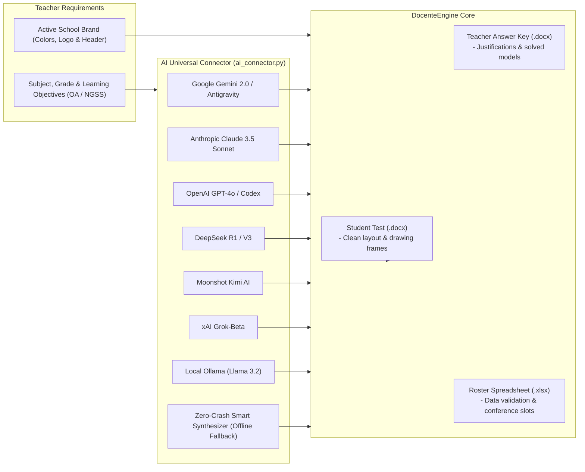

<div align="center">

[🇺🇸 **English (Active)**](README.md) · [🇪🇸 **Leer en Español**](README.es.md)



# ✦ EduDocente-Studio ✦
### *Autonomous Multi-AI Pedagogical Assessment & Global Curriculum Engine*

[](https://python.org)
[](#-multi-ai-universal-connector)
[](#-global-curriculum-readiness)
[](#-multi-school-institutional-branding-memory)
[](LICENSE)

<p align="center">
  <b>A declarative, AI-orchestrated curriculum platform that transforms textbook chapters, learning standards, and pedagogical requirements into publication-grade, print-ready student examinations, justified teacher answer keys, family study guides, and dynamic student rosters in Microsoft Word (.docx) and Excel (.xlsx).</b>
</p>

[✨ Core Features](#-core-features) •
[🌍 Global Curriculum](#-global-curriculum-readiness) •
[🤖 Multi-AI Connector](#-multi-ai-universal-connector) •
[🏛️ Multi-School Branding](#-multi-school-institutional-branding-memory) •
[📊 Excel Roster Manager](#-dynamic-excel-student-roster--conference-manager) •
[🔐 OAuth 2.0](#-enterprise-authentication--sso-oauth-20) •
[🚀 Quick Start](#-quick-start--installation) •
[📄 License](#-license)

</div>

---

## 💡 The Problem & The Solution

### The Challenge
Educators spend over 15 hours each week authoring tests, writing feedback keys, preparing parent syllabus notices, and organizing student conference spreadsheets. In manual word processors, this creates severe pain points:
* **Branding Friction:** Teachers working across multiple academies or school districts must manually re-create headers, color palettes, and logos.
* **Leakage of Answer Clues:** Unintentional formatting hints or distractor imbalances left in the student copy.
* **Lack of Pedagogical Rationale:** Bare-minimum answer keys without direct citations to textbook pages or curricular competencies.
* **Spreadsheet Chaos:** Outdated, manually formatted parent contact lists with inconsistent attendance data.

### Our Solution
**EduDocente-Studio** standardizes the entire assessment engineering lifecycle through an autonomous, declarative pipeline:
1. **Universal 3-Tier Pedagogical Architecture:**
   - **Tier I (Multiple Choice):** Clean direct options `A)`, `B)`, `C)`, `D)` without distractor boxes, complete with pedagogical rationales citing source materials in the teacher answer key.
   - **Tier II (True/False):** Clean `(   )` answer slots for students and clear validation matrices highlighted in institutional green (`#1E7E34`) for educators.
   - **Tier III (Technical Drawing & Schematic Application):** Bounded drawing frames with guided prompt lines and vector diagram skeletons (electric circuits, kinetic matter particles, atomic models).
2. **Multi-School Identity Memory:** Persistently stores high-resolution transparent logos, 5-color corporate palettes, and institutional department headers in `config/institutions.json`.
3. **Dynamic Excel Roster & Conference Engine:** Generates styled `.xlsx` spreadsheets with auto-adjusted columns and native cell data validation dropdowns.

---

## 🌍 Global Curriculum Readiness

EduDocente-Studio is **curriculum-agnostic** and built to adapt to any educational framework worldwide:

| Curriculum Framework | Region | Key Support & Integration |
| :--- | :--- | :--- |
| **US NGSS & Common Core** | United States / International | Performance expectations, disciplinary core ideas, science and engineering practices. |
| **International Baccalaureate (IB)** | Global (MYP & DP) | Criterion-referenced assessment rubrics, inquiry-based prompts, and command terms. |
| **Cambridge IGCSE & A-Levels** | UK / Commonwealth | Structured knowledge recall, analytical multiple-choice, and practical paper frameworks. |
| **Mineduc K-12 Standards** | Chile / Latin America | Learning Objectives (OA), prioritized curriculum, and official textbook page citations. |
| **SEP Framework** | Mexico / LATAM | Formative assessment competencies, learning fields (*Campos Formativos*), and contextual projects. |
| **Higher Ed & STEM Academies** | Worldwide | Physics circuits, atomic theories, microbiology, music theory, and health sciences. |

> [!TIP]
> The engine accepts inputs in English, Spanish, Portuguese, or any language. While tests and rubrics can be generated in any target tongue, the developer interface and repository follow international English conventions.

---

## 🤖 Multi-AI Universal Connector

EduDocente-Studio integrates a vendor-agnostic AI orchestration router (`ai_connector.py`):



### Supported AI Providers:
* ♊ **Google Gemini 2.0 & Antigravity** (`gemini-1.5-pro` / `gemini-2.0-flash`) — Native curriculum grounding.
* 🧠 **Anthropic Claude 3.5** (`claude-3-5-sonnet`) — Rigorous pedagogical rationales and nuanced distractors.
* ⚡ **OpenAI GPT-4o / Codex** (`gpt-4o`) — High-throughput JSON schema compilation.
* 🐋 **DeepSeek R1 & V3** (`deepseek-chat` / `deepseek-reasoner`) — Deep deductive reasoning for STEM tests.
* 🌙 **Moonshot Kimi AI** (`moonshot-v1-8k`) — Long-context textbook processing.
* 🚀 **xAI Grok** (`grok-beta`) — Concise, direct instructional synthesis.
* 💻 **Local / Ollama** (`llama3.2`, etc.) — 100% private, offline execution on your workstation.
* 🛡️ **Zero-Crash Smart Pedagogical Synthesizer:** Built-in heuristic fallback allowing full end-to-end testing without external API keys.

---

## 🏛️ Multi-School Institutional Branding Memory

For teachers instructing at more than one school, university, or academy, EduDocente-Studio maintains persistent branding profiles in `config/institutions.json`:

```json
{
  "id": "cambridge_academy",
  "name": "CAMBRIDGE INTERNATIONAL ACADEMY",
  "sub_header": "DEPARTMENT OF NATURAL SCIENCES & MATHEMATICS",
  "motto": "Veritas, Scientia et Excellentia",
  "logo_path": "assets/logos/cambridge_crest.png",
  "font_family": "Arial",
  "colors": {
    "primary_hex": "0A2540",
    "secondary_hex": "EAF3FB",
    "card_bg_hex": "F6FAFE",
    "border_hex": "B0C4DE",
    "teacher_correct_hex": "1E7E34"
  },
  "is_active": true
}
```

* **Instant Dynamic Theme Switching:** Changing schools in the Web UI or via `institution_manager.set_active("id")` immediately re-themes all generated Word examinations, teacher keys, and Excel sheets with the chosen school's transparent logo, typography, and palette.
* **Transparent Logo Support:** Handles ultra-high-resolution PNG, SVG, and WEBP image assets.

---

## 📊 Dynamic Excel Student Roster & Conference Manager

The `roster_manager.py` module automates parent-teacher conferences and academic follow-up:

* **Configurable Columns:** `ID`, `Parent Name`, `Email`, `Student Name`, `Grade/Class`, `Day`, `Conference Date`, `Time Slot`, `Status`, and `Notes`.
* **In-Cell Data Validation:** Native dropdowns for status management: `Confirmed`, `Pending`, `Rescheduled`, `Absent`.
* **Automatic Institutional Styling:** Applies the active school's brand color to column headers, gentle borders, zebra fills (`#F6FAFE` / `#FFFFFF`), and auto-fitted column widths.
* **Real-Time Live Updates:** Modify conference attendance directly from the **"2. Nóminas & Entrevistas Excel"** web tab with 1-click status toggling and instant `.xlsx` export.

---

## 🔐 Enterprise Authentication & SSO (OAuth 2.0)

The `oauth_manager.py` layer provides out-of-the-box Single Sign-On readiness:

1. **Google Workspace for Education / Google Classroom:**
   - Scopes: `classroom.courses.readonly`, `classroom.rosters.readonly`, `userinfo.email`.
2. **GitHub Academic (`@JackStar6677-1`):**
   - Classroom repository and curriculum versioning.
3. **Microsoft 365 Education (Entra ID):**
   - Microsoft Teams for Education and institutional Active Directory rosters.
4. **Built-In Sandbox Mode:**
   - Instant 1-click demonstration without needing prior OAuth app registration in Google Cloud Console.

---

## 🚀 Quick Start & Installation

### 1. One-Click Windows Launch (Recommended for Educators)
Double-click `install.bat` to prepare dependencies, then double-click `start.bat` to launch the local web app and open your browser at `http://localhost:8080`.

### 2. Manual Installation
```bash
# Clone repository
git clone https://github.com/JackStar6677-1/edudocente-studio.git
cd edudocente-studio

# Install dependencies
pip install -r requirements.txt

# Launch interactive Web UI
python app.py
```

### 3. Docker Container Deployment (For School IT Departments)
```bash
docker-compose up -d
# Access web dashboard at http://localhost:8080
```

### 4. Environment Variables Setup (`.env`)
```bash
# Copy template
cp .env.example .env

# Configure API keys (optional)
GEMINI_API_KEY="your_gemini_key"
ANTHROPIC_API_KEY="your_claude_key"
OPENAI_API_KEY="your_openai_key"
PORT=8080
```

---

## 💻 CLI & Interactive Modes

```bash
# Web Interface (Single-Page Application)
python app.py

# Interactive AI Session via Console
python ai_connector.py
# or:
python main.py --ai

# Step-by-Step Manual Question Wizard
python wizard.py
# or:
python main.py --wizard

# Batch Compilation of Included Case Studies
python main.py --all
```

---

## 📁 Repository Structure

```text
edudocente-studio/
│
├── assets/                               # Vector assets, animated banners & logos
│   ├── banner_animated.svg               # Cybernetic GitHub & UI banner
│   ├── logo_colegio.png                  # Transparent school crest
│   ├── circuit_components/               # Schematic electrical symbols
│   ├── matter_states/                    # Kinetic matter particle diagrams
│   └── atom_model/                       # Vector atomic model skeletons
│
├── config/                               # Persistent memory storage
│   ├── institutions.json                 # Multi-school profiles, logos & color hexes
│   └── roster_data.json                  # Configurable student conference database
│
├── web/                                  # Frontend Web Dashboard (Tailwind CSS SPA)
│   └── index.html                        # 4-Tab interface with live exam sheet preview
│
├── output/                               # Compiled publication deliverables
│   ├── temarios/                         # Official parent notices
│   ├── Evaluacion_Final_Ciencias_6Basico.docx
│   ├── Pauta_Correccion_Ciencias_6Basico.docx
│   └── Cronograma_Entrevistas_Apoderados_2026.xlsx
│
├── app.py                                # Local multi-threaded HTTP server & REST API
├── oauth_manager.py                      # OAuth 2.0 manager (Google, GitHub, Microsoft)
├── institution_manager.py                # Multi-school branding memory
├── roster_manager.py                     # Excel roster and interview manager
├── ai_connector.py                       # Universal Multi-AI router (Claude, Gemini, GPT-4o, DeepSeek)
├── engine.py                             # Declarative core compiler (DocenteEngine)
├── generator_core.py                     # Word XML typography and dynamic styling
├── wizard.py                             # Interactive CLI creation assistant
├── main.py                               # Master CLI orchestrator with flags
│
├── install.bat / install.sh              # 1-Click installers for Windows & Linux/macOS
├── start.bat                             # 1-Click double-click web launcher
├── Dockerfile / docker-compose.yml       # Production containerization
├── .env.example                          # Environment variables template
├── requirements.txt                      # Official Python dependencies
├── LICENSE                               # MIT License
├── README.es.md                          # Spanish documentation
└── README.md                             # English documentation (Primary)
```

---

## 🔮 Future Roadmap (Beta Lab)

Explore tab **"4. Próximamente (En Desarrollo)"** in the Web UI:
* 📷 **Mobile & Webcam OMR Scanner:** Instant automated scoring of bubble sheets using computer vision.
* 🔗 **Bi-Directional LMS Sync:** Direct publishing to Google Classroom announcements and Canvas assignments.
* 🖨️ **QR-Serialized Exam Booklets:** Unique security serialization per student to eliminate copying.
* 📊 **Psychometric Item Discrimination:** Difficulty index calculation and formative learning recommendations.

---

## 👨‍💻 Author & Acknowledgments

- **Software Architecture & Development:** Jack ([@Jackstar6677-1](https://github.com/Jackstar6677-1))
- **Educational Technology & Pedagogy:** Open Institutional Framework

---

## 📄 License

Distributed under the [MIT License](LICENSE). Feel free to fork, adapt, and deploy for your own educational institution.
